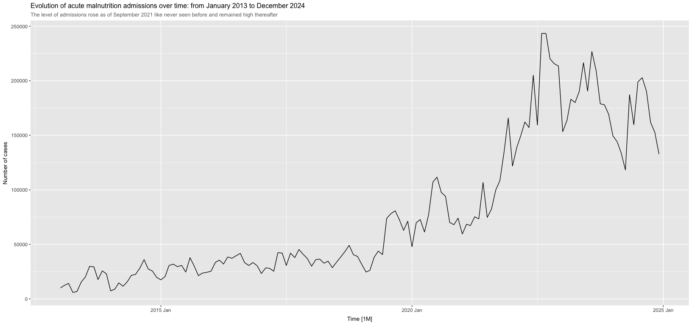
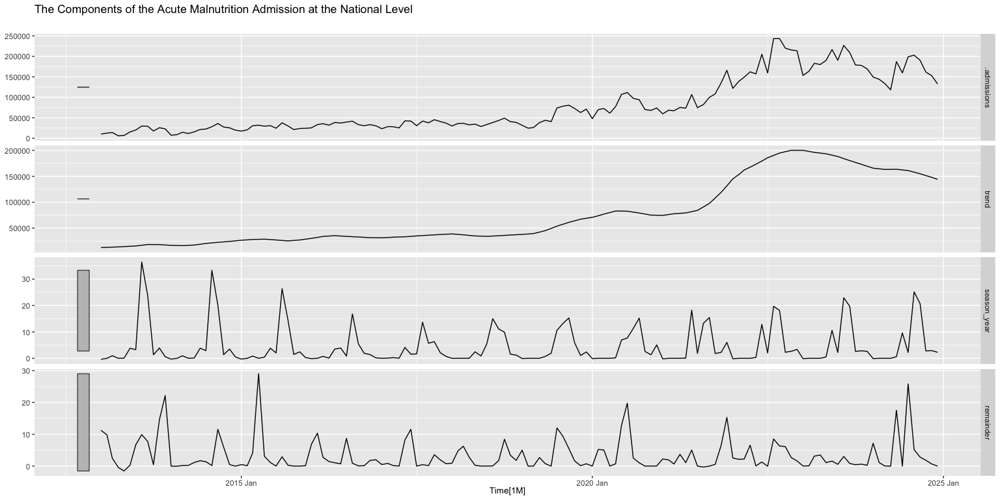

# Understanding seasonal patterns of acute malnutrition and common childhood diseases in Afghanistan

## Insights from 14 of acute malnutrition and five years of childhood illnesses admission data

👋 Hello, and welcome to this repository!

This repository presents a time series analysis conducted to glean
insights into the seasonal variations of acute malnutrition and common
childhood illnesses in Afghanistan. The analysis draws on a rich
dataset, spanning 14 years of acute malnutrition admissions and five
years of admissions for common child illnesses.

The ultimate objective is to generate evidence-based insights to support
the IPC Acute Malnutrition analysis parameters and to guide the optimal
timing of nutrition data collection efforts in the country.

> [!NOTE]
>
> This analysis was made possible thanks to the strong collaboration of
> [Afghanistan’s Nutrition Cluster Coordination
> Team](https://www.nutritioncluster.net/country/afghanistan) and
> UNICEF. Their support and insights were instrumental throughout the
> process.

## A glance at the results

### The time series plot

### The components

## Repository Structure

The repository is structured in the following way:

- `data/raw`: data.frames containing admissions over time. Data is
  reported on a monthly basis, with a reporting rate over 98%. The
  reporting rate is defined as the number of catchment areas that
  submitted their reported in a given month, divided by the overall
  number of catchment areas that are expected to report.
- `R/`: some handy user-defined functions for the project.  
- `scripts/`: A set of `R` scripts used for the analysis.

The project workflow can be implemented simply by running the `script.R`
file found in the root directory.

## Reproducibility information

The repository was created in `R` version 4.5.1 This project uses the
`{renv}` framework to record `R` package dependencies and versions.
Packages and versions used are recorded in `renv.lock` and code used to
manage dependencies is in `renv/` and other files in the root project
directory. On starting an `R` session in the working directory, run
`renv::restore()` to install R package dependencies.

## Data encryption

This project uses `{cyphr}` to encrypt the raw data that lives in
`data-raw/` directory. In order to be able to access and decrypt the
encrypted data, the user will need to have created their own personal
SSH key and make a request to be added to the project. An easy-to-grasp
guide on how to make a request will be found
[here](https://github.com/OxfordIHTM/cyphr-encryption-demonstration#)

## License

This repository is licensed under a GNU General Public License 3
(GPL-3).

## Feedback

If you wish to give feedback, file an issue or seek support, kindly do
so [here](https://github.com/nutimes/afg-amn-admit/issues).

## Author

Tomás Zaba
